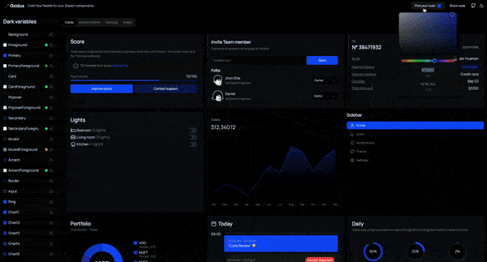
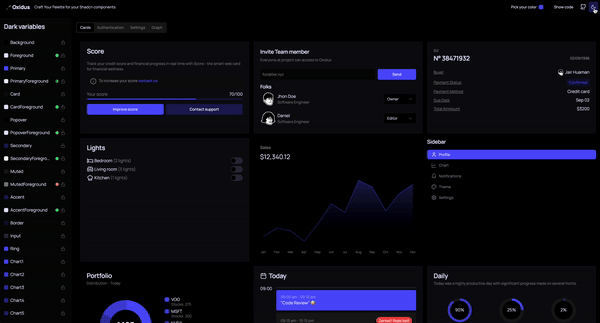
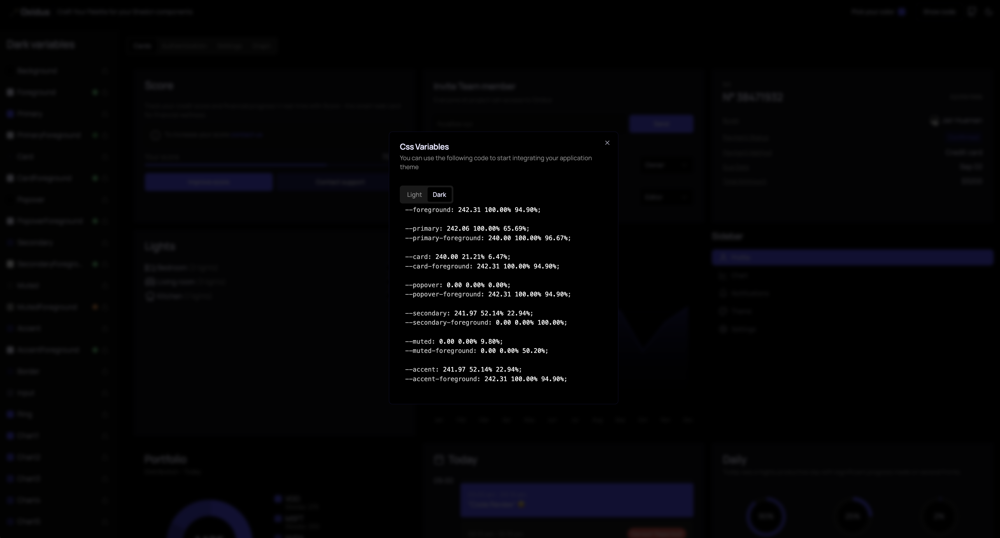
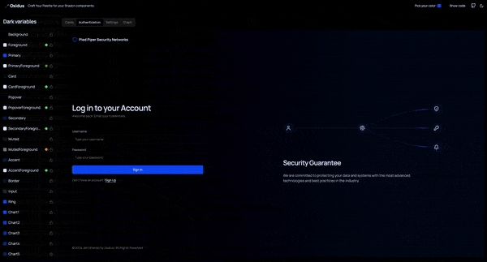
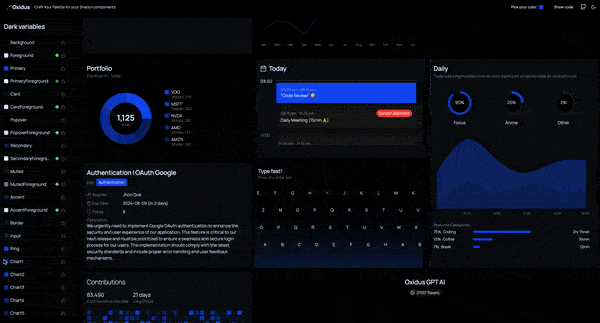
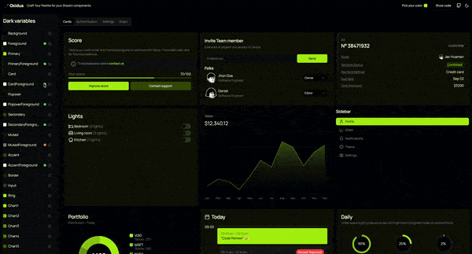

# 🪄 Oxidus

Craft your color palette for your shadcn projects

## ⚡️ Features
* ### Color Palette Generation
    Automatically create a cohesive color palette from a base color.

        
* ### Dark and Light Theme Support
    Implement dark and light modes with customizable variables.

    
* ### HSL Variable Export
    Export theme variables in HSL format.

    
* ### Customizable Variables
    Modify individual color variables to fit specific design needs.

    
* ### Color Locking
    Lock specific colors to maintain consistency.

    
* ### WCAG Contrast Checker
    Ensure color contrast meets WCAG accesbility standards.

    